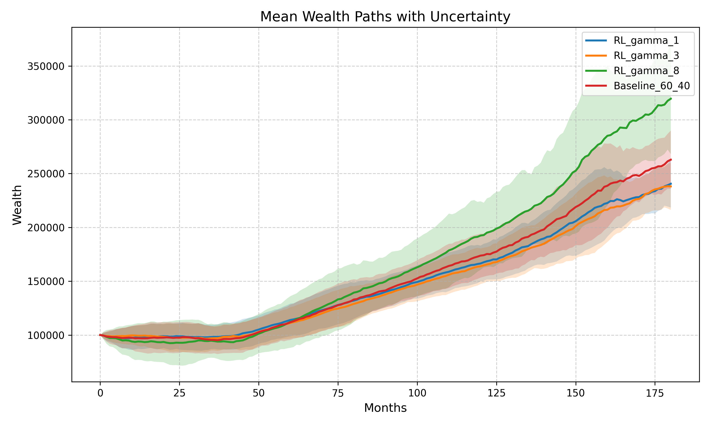
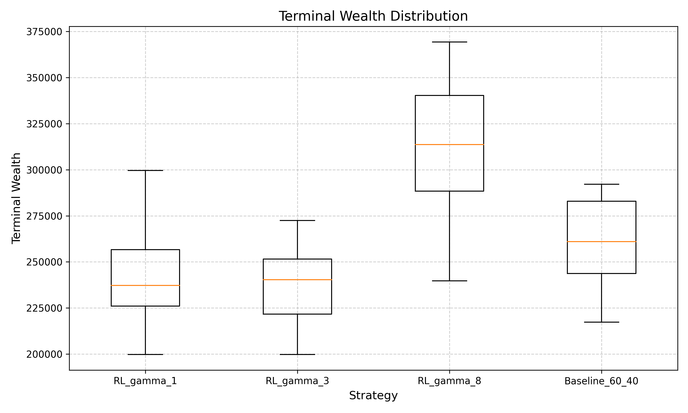
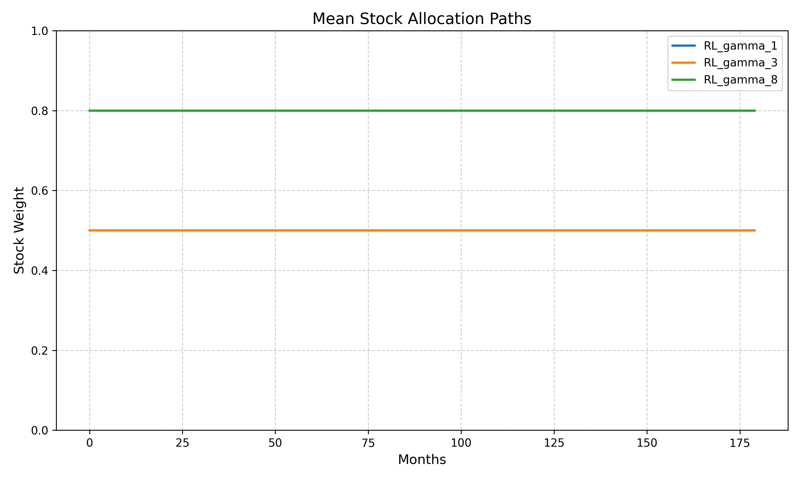

# Reinforcement Learning for Lifecycle Portfolio Allocation

This project explores how reinforcement learning (RL) can be used for lifecycle portfolio allocation, and whether it actually provides an advantage over simple strategies like the classic 60/40 portfolio.

---

## Motivation

RL is often expected to produce more adaptive and intelligent strategies than traditional rules. This is especially appealing in long-term investment problems, where decisions need to evolve over time.

However, it is not always clear whether RL truly improves performance, or whether it simply learns patterns that are already well known in finance.

This project tries to examine that question in a simple lifecycle setting.

---

## What I did

I built a custom RL environment to simulate lifecycle investing using historical data:

- Assets: SPY (stocks) and AGG (bonds)
- Horizon: 180 months
- Initial wealth: 100,000
- Target wealth: 500,000

At each step, the agent chooses between:

- 20% stock / 80% bond  
- 50% stock / 50% bond  
- 80% stock / 20% bond  

Risk preference is modeled using CRRA utility with different values of γ (1, 3, 8).

I trained DQN agents using `stable-baselines3`, and compared them against a fixed 60/40 benchmark.

---

## Results

### Wealth trajectories



The most aggressive agent (γ = 8) achieves the highest average terminal wealth, but also shows much higher variability.

---

### Terminal wealth distribution



Compared to the 60/40 strategy, the RL policy with γ = 8 performs better on average, but with a wider spread and higher downside risk.

---

### Allocation behavior



Different γ values lead to different allocation patterns:

- γ = 1 → roughly balanced allocation  
- γ = 3 → similar behavior  
- γ = 8 → consistently high equity exposure  

---

## What I found

A few observations from this project:

- RL is able to reflect different risk preferences through its learned policy  
- However, the resulting strategies mostly follow the classical intuition:
  - higher risk → higher return → higher volatility  
- RL does not consistently outperform the simple 60/40 benchmark  

In other words, RL seems to capture known risk-return trade-offs rather than discovering fundamentally new strategies.

---

## Limitations

There are several simplifications in this project:

- discrete action space  
- limited historical data  
- simple state representation  
- no transaction costs  

These factors likely affect the performance of RL.

---

## Possible improvements

Some natural next steps would be:

- continuous allocation (e.g. PPO / SAC)  
- richer state variables  
- more realistic market modeling  

---

## How to run

```bash
pip install -r requirements.txt
python train_multi_gamma.py
python evaluate_with_baseline.py
python plot_results.py